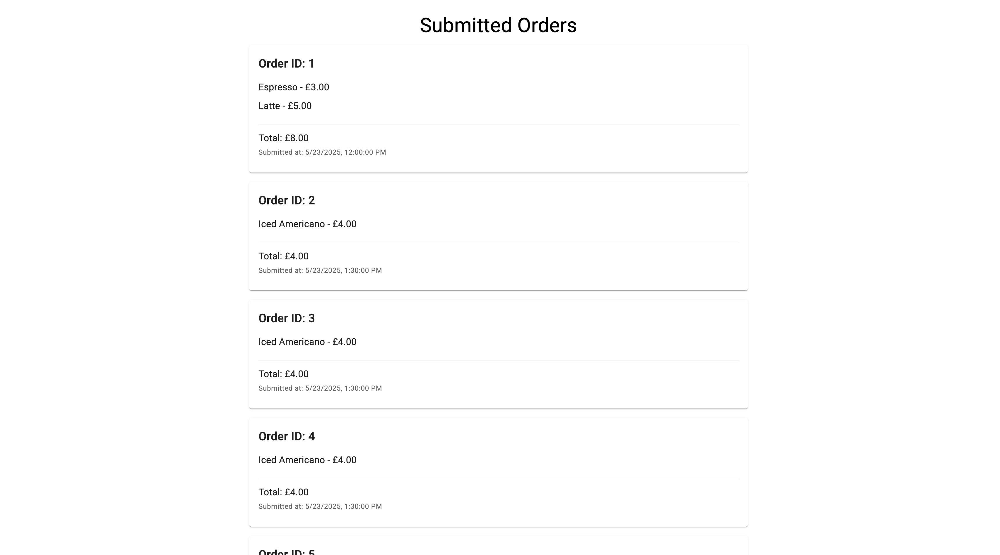

# 📦 Orders Web Client

A simple React + TypeScript + Material UI single-page app to view submitted orders. This internal tool fetches orders from a mocked backend and displays them in a clean, responsive UI.

---

🚀 Features  
✅ Displays list of submitted orders  
🧾 Shows item names, prices, total cost, and timestamps  
🎨 Built with Material UI for elegant components  
⚙️ Written in TypeScript  
🧠 Uses mock JSON data (no backend needed)  
📐 Clean formatting with currency and time  
🛠️ Linting and formatting support

---

🛠️ Installation

```bash
git clone https://github.com/y-alshazly/orders-web-client.git
cd orders-web-client
yarn install
```

## 🏃 Running the Project

- **Start development server**:

  ```bash
  yarn start
  ```

- **Build for production**:

  ```bash
  yarn build
  ```

- **Run tests**:

  ```bash
  yarn test
  ```

- **Eject configuration (not recommended unless needed)**:

  ```bash
  yarn eject
  ```

## 📱 Screenshots


